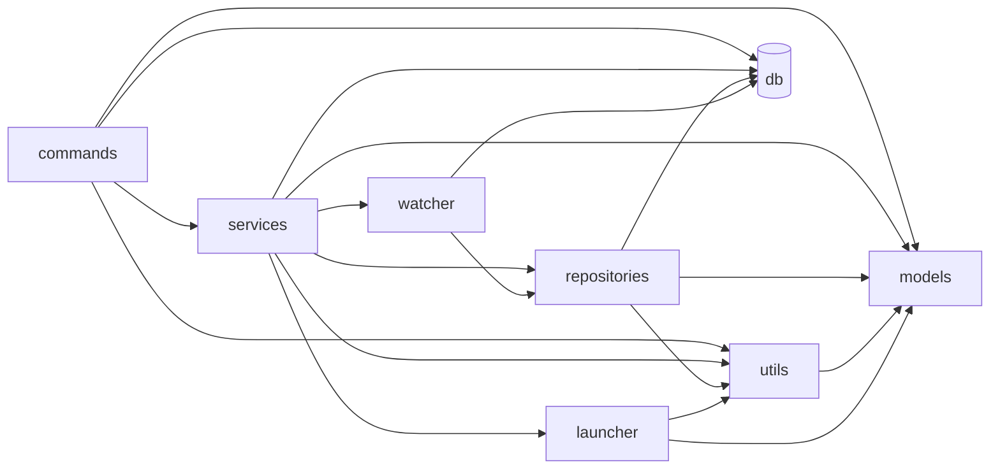

# Rust モジュール依存グラフ

作成日: 2026-04-25 / batch-59 PH-249

## 概要

`src-tauri/src/` の内部モジュール依存関係。

| モジュール   | 直接依存先                                         |
| ------------ | -------------------------------------------------- |
| commands     | services, models, utils, db, watcher               |
| services     | repositories, models, utils, db, launcher, watcher |
| repositories | models, utils, db                                  |
| models       | (なし)                                             |
| utils        | models                                             |
| watcher      | repositories, db                                   |
| launcher     | models, utils                                      |
| db           | (rusqlite のみ)                                    |

## Mermaid 依存グラフ



## レイヤー構造（Clean Architecture 準拠）

```
[commands/]  ← Tauri IPC エントリーポイント (58 cmd_* 関数)
    ↓ services のみ経由
[services/]  ← ビジネスロジック
    ↓ repositories のみ経由
[repositories/]  ← データアクセス (SQLite)
    ↓
[models/]  ← ドメインモデル（依存なし）

[utils/]  ← 共通ユーティリティ（models のみ参照）
[watcher/]  ← ファイルシステム監視（repositories 経由でDB更新）
[launcher/]  ← OS コマンド起動
```

## レイヤー違反チェック結果

**違反なし** — 全モジュールが設計通りの一方向依存。

- commands → repositories 直接参照: **なし** ✅
- services → commands 参照: **なし** ✅
- repositories → services 参照: **なし** ✅
- 循環依存: **なし** ✅

## 直接依存クレート（Cargo.toml）

| クレート           | 用途                 |
| ------------------ | -------------------- |
| rusqlite           | SQLite アクセス      |
| rusqlite_migration | DB マイグレーション  |
| serde / serde_json | シリアライズ         |
| tauri              | Tauri フレームワーク |
| thiserror          | エラー型             |
| uuid               | UUID v7 生成         |
| notify             | ファイルシステム監視 |
| clap               | CLI 引数パーサー     |
| log                | ロギング             |
| zip                | zip 圧縮             |
