# フォルダ構成 / モジュール境界 評価レポート

batch-82 PH-366（Refactor Era 計測フェーズ）。**コード変更なし、評価のみ**。

判定基準: 「ファイル開いて 30 秒で何が書いてあるか分かる」を初見の人（agent / 共同開発者 / 将来の自分）に対して保証。

---

## 1. 現状フォルダ構成

```mermaid
graph TD
    Root[arcagate/]
    Root --> Src[src/]
    Root --> SrcTauri[src-tauri/]
    Root --> Tests[tests/]
    Root --> Docs[docs/]

    Src --> Routes[routes/ — SvelteKit 画面]
    Src --> Lib[lib/]
    Src --> AppCSS[app.css / app.html]

    Lib --> Components[components/]
    Lib --> State[state/ — Svelte 5 runes store]
    Lib --> IPC[ipc/ — Tauri invoke wrapper]
    Lib --> Types[types/]
    Lib --> Bindings[bindings/ — ts-rs auto-gen]
    Lib --> Utils[utils/]
    Lib --> Constants[constants/]
    Lib --> Assets[assets/]
    Lib --> Styles[styles/]
    Lib --> NavItems[nav-items.ts]

    Components --> Arcagate[arcagate/]
    Components --> Item[item/ — ItemForm 等]
    Components --> Settings[settings/]
    Components --> Setup[setup/ — SetupWizard]
    Components --> UI[ui/ — shadcn-svelte]

    Arcagate --> ArcCommon[common/ — Tip / WidgetShell 等]
    Arcagate --> ArcLibrary[library/]
    Arcagate --> ArcPalette[palette/]
    Arcagate --> ArcWorkspace[workspace/]

    SrcTauri --> SrcRust[src/]
    SrcRust --> Commands[commands/ — Tauri IPC handler]
    SrcRust --> Services[services/ — business logic]
    SrcRust --> Repositories[repositories/ — DB CRUD]
    SrcRust --> Models[models/ — struct/enum]
    SrcRust --> Launcher[launcher/]
    SrcRust --> Watcher[watcher/]
    SrcRust --> Db[db/]
    SrcRust --> RustUtils[utils/]
    SrcRust --> Bin[bin/ — CLI binary]
```



---

## 2. モジュール境界の評価

### フロント (`src/lib/`)

| サブディレクトリ | 責務（推測） | 初見明瞭度 | 命名一貫性 | 責務分離 | コメント |
|---|---|---|---|---|---|
| `components/arcagate/` | 「アプリ固有」コンポーネント全般 | △ | ◯ | △ | `arcagate/` という分類が広すぎる（ライブラリ + ウィジェット + パレット 全部入り） |
| `components/arcagate/workspace/` | Workspace shell + 全 widget + dialog | ✕ | ◯ | ✕ | **20+ ファイル混在、widget 本体 / shell / dialog が同一階層** |
| `components/arcagate/library/` | Library 画面の構成要素 | ◯ | ◯ | ◯ | Card / Sidebar / DetailPanel が綺麗に分離 |
| `components/arcagate/palette/` | Palette overlay | ◯ | ◯ | ◯ | 集約良好 |
| `components/arcagate/common/` | 横断汎用（Tip / WidgetShell） | △ | ◯ | △ | 「common」は粒度差大、WidgetShell は workspace 専用なのに common にある |
| `components/item/` | アイテム CRUD UI | ◯ | ◯ | ◯ | |
| `components/settings/` | Settings 画面 | △ | ◯ | △ | LibraryCardSettings.svelte が settings/ にあるのは配置疑問（library/ 配下が論理的） |
| `components/setup/` | 初回セットアップ Wizard | ◯ | ◯ | ◯ | |
| `components/ui/` | shadcn-svelte scaffold | ◯ | ◯ | ◯ | 手動編集禁止と明記済 |
| `state/` | Svelte 5 runes store | ◯ | ◯ | ◯ | `*.svelte.ts` 命名で runes と分かる |
| `ipc/` | Tauri invoke wrapper | ◯ | ◯ | ◯ | 1 file = 1 機能領域、綺麗 |
| `bindings/` | ts-rs auto-gen | ◯ | ◯ | ◯ | コメントで "Do not edit" 明記、ignore 設定済 |
| `utils/` | 汎用ヘルパ | △ | ◯ | △ | 純粋関数 + domain 軽ロジック混在（`format-meta.ts` は item 関連、`tag-suggest.ts` も） |
| `types/` | グローバル型 | ◯ | ◯ | ◯ | `workspace.ts` / `tag.ts` 等、扱う domain ごと |
| `constants/` | item 種別ラベル等 | ◯ | ◯ | ◯ | |

### バックエンド (`src-tauri/src/`)

| サブディレクトリ | 責務 | 評価 | コメント |
|---|---|---|---|
| `commands/` | Tauri IPC handler 薄ラッパ | ◯ | 各 command が `cmd_*` 接頭辞、services を call するだけ |
| `services/` | business logic | ◯ | layer 一方向依存、テスト可能 |
| `repositories/` | DB CRUD | ◯ | `find_by_id` / `insert` 等の標準形式 |
| `models/` | struct + enum | ◯ | serde derive、ts-rs 適用拡張中 |
| `launcher/` | プロセス起動ロジック | ◯ | 単一責務 |
| `watcher/` | ファイル監視 | ◯ | notify wrapper |
| `db/` | DB 接続 + マイグレーション | ◯ | |
| `utils/` | error / icon / git 等 | △ | error 型と git CLI ラッパが同居、粒度差あり |
| `bin/` | CLI binary（arcagate_cli） | ◯ | 1 file 1438 行、巨大だがエントリポイントなので許容 |

---

## 3. 混乱箇所 top 10（構造フェーズ batch-83 で潰す候補）

| # | 場所 | 問題 | 影響 |
|---|---|---|---|
| 1 | `components/arcagate/workspace/` 20+ files | widget 本体 / dialog / shell / sidebar / hint / rename / delete-confirm が同一階層に混在 | 新規 widget 追加時にどこに置くか迷う、grep が爆発 |
| 2 | `WidgetSettingsDialog.svelte` 583 行 | 9 widget 用の if/else if が雪だるま | 新規 widget 追加で行が膨張、共通項目の重複 |
| 3 | `WorkspaceLayout.svelte` 487 行 | 1 ファイルに pan / Del キー / 確認ダイアログ / widget map / rename / context panel が同居 | 改修箇所の特定が困難 |
| 4 | `components/arcagate/common/` の粒度差 | `Tip` (横断汎用) と `WidgetShell` (workspace 専用) が同居 | 「common とは何か」の定義が曖昧 |
| 5 | `components/settings/LibraryCardSettings.svelte` の配置 | Library 設定 UI なのに settings/ 配下、library/ にあるべき | 改修時に検索範囲が広がる |
| 6 | `lib/utils/` の粒度差 | `format-meta.ts` (item 専用) と汎用ヘルパが同居 | utils が domain 知識を持つ汚染 |
| 7 | `arcagate_cli.rs` 1438 行 | 単一ファイルに全サブコマンド + 引数 parsing | maintainable な分割が必要 |
| 8 | `item_repository.rs` 685 行 | CRUD + auto-register + tag 関連が同居 | 責務分離が薄い |
| 9 | `state/workspace.svelte.ts` 338 行 | workspace + widget の state を 1 ファイルに集約 | widget 独立性が低い（registry 化と関連） |
| 10 | `SettingsPanel.svelte` 455 行 | 6 カテゴリ × 各 UI を 1 ファイルに | カテゴリごとに分割できる（PH-351 の方針と同じ） |

---

## 4. 構造フェーズ（batch-83）への提案

### 提案 1: widget folder-per-widget colocation

`components/arcagate/workspace/` の widget 関連を `lib/widgets/<name>/` に集約:

```
src/lib/widgets/
├── _shared/                    # WidgetShell, 共通型
├── clock/{ClockWidget.svelte, ClockSettings.svelte, index.ts}
├── exe-folder/...
└── ...（14 widget）
```

Workspace shell（WorkspaceLayout / WorkspaceSidebar / WorkspaceWidgetGrid 等）は `components/arcagate/workspace/` に残す。

### 提案 2: WidgetSettingsDialog 解体

各 `<Name>Settings.svelte` を `widgets/<name>/` に切り出し、`<svelte:component>` で動的 mount。500+ 行 → 50 行のシェルに。

### 提案 3: Settings 内コンポーネントの再配置

- `components/settings/LibraryCardSettings.svelte` → `components/arcagate/library/LibrarySettings.svelte`
- `Tip` を `components/common/` か `lib/ui/` に移動して横断汎用を明確化

### 提案 4: utils/ の分離

- `format-meta.ts` (item 専用) → `lib/items/format.ts` 等の domain 配置
- 汎用は `utils/` に残す

### 提案 5: arcagate_cli.rs の分割

- `bin/arcagate_cli/main.rs` + `commands/{create,run,list,...}.rs` のサブモジュール化

---

## 評価サマリ

- **強み**: ipc / state / models / commands / services / repositories / bindings は責務分離が綺麗
- **弱み**: components/arcagate/workspace/ と一部の大型ファイル（WidgetSettingsDialog / WorkspaceLayout / arcagate_cli）に肥大化
- **構造フェーズで触る範囲**: 上記 top 10 の半分くらいを batch-83 で消化、残りは batch-84 簡素化と分担

次フェーズ (batch-83) の plan 詳細は PH-369 整理で提案する。
